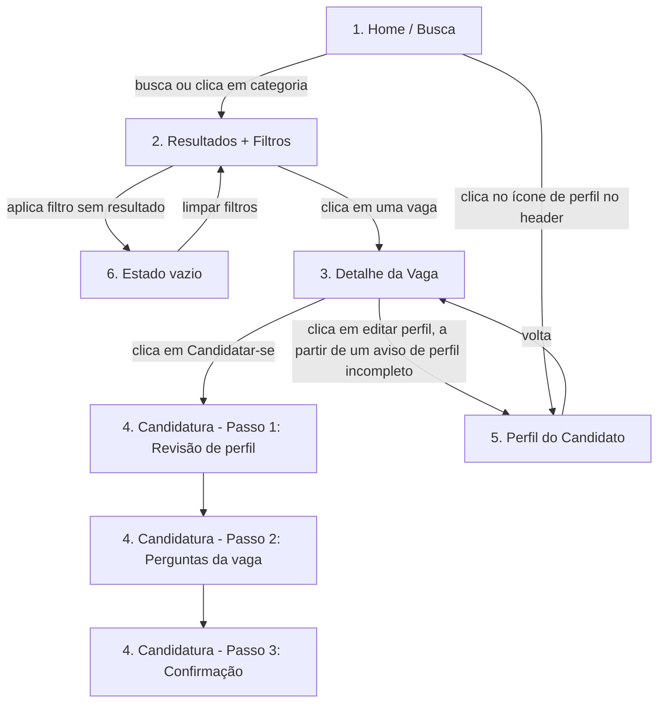

# Wireframes e Fluxo — Protótipo "VagaCerta"
### Especificação para construção no Figma

> ✅ **Atualização**: este protótipo foi construído diretamente como HTML/CSS/JS clicável e funcional — ver [`prototype/index.html`](prototype/index.html). Abra o arquivo em qualquer navegador para testar. A especificação abaixo continua válida como documentação de referência do que foi (e precisa continuar sendo) construído.

> Este documento descreve, tela a tela, o que precisa existir no protótipo para cobrir as 6 tarefas do Teste de Usabilidade (protocolo, seção 3.1) e a árvore de IA do Tree Testing (protocolo, seção 4.2). É uma especificação de conteúdo/estrutura, não de estilo visual — decisões de cor, tipografia e grid ficam a seu critério no Figma (posso ajudar com isso depois, se quiser, usando o mesmo sistema de design que você pretende aplicar no `src/` do portfólio).

## Mapa de telas → tarefas cobertas

| Tela | Cobre a(s) tarefa(s) |
|---|---|
| 1. Home / Busca | Ponto de entrada de todas as tarefas |
| 2. Resultados + Filtros | T1, T2, T6 |
| 3. Detalhe da Vaga | T3 |
| 4. Fluxo de Candidatura (3 passos) | T4 |
| 5. Perfil do Candidato | T5 |
| 6. Estado vazio / 0 resultados | Apoio — não é uma tarefa, mas precisa existir para não travar o teste se o participante filtrar demais |

## Fluxo de navegação

---

## Tela 1 — Home / Busca

**Objetivo**: ponto de entrada; permitir busca livre (texto) ou navegação por categoria, sem forçar o usuário a saber o termo técnico exato.

**Componentes**:
- Header fixo: logo "VagaCerta" (esquerda) + ícone de perfil (direita)
- Campo de busca central, grande, com placeholder: *"Busque por cargo, área ou palavra-chave"*
- Abaixo do campo de busca: **atalhos de categoria em formato de cards/chips clicáveis** (não escondidos em menu) — isso é importante para o Tree Testing funcionar bem em texto puro. Sugestão de chips, refletindo a árvore de IA definida no protocolo:
  - "Tecnologia" · "Administrativo" · "Comercial/Vendas" · "Saúde" · "Educação"
  - "Remoto" · "Híbrido" · "Presencial"
  - "Estágio" · **"Jovem Aprendiz"** · "CLT" · "PJ"
- Seção "Vagas em destaque" (3-4 cards de vaga, opcional, para dar sensação de produto vivo)

**Nota de design crítica para o teste**: o chip "Jovem Aprendiz" deve estar visível nesta tela sem precisar abrir nenhum menu — é o teste real de se essa categoria é encontrável ou não para quem nunca usou o termo antes (Théo, na T6).

---

## Tela 2 — Resultados + Filtros

**Objetivo**: exibir lista de vagas e permitir refinar por filtro; é a tela onde T1, T2 e T6 acontecem.

**Componentes**:
- Barra de busca reaparece no topo (persistente), já com o termo buscado
- Painel de filtros (lateral em desktop, ou "Filtrar" expansível em mobile) com os 5 grupos definidos na árvore de IA:
  1. **Área/Setor** (checkbox múltiplo)
  2. **Tipo de contrato**: CLT, PJ, Estágio, **Jovem Aprendiz**, Freelance/Temporário
  3. **Modalidade**: Remoto, Híbrido, Presencial
  4. **Senioridade**: Estagiário/Aprendiz, Júnior, Pleno, Sênior, Liderança/Gestão
  5. **Faixa salarial** (slider ou seleção de faixas)
- Lista de resultados: cada card de vaga mostra — título do cargo, empresa, cidade/modalidade, faixa salarial (se disponível), tipo de contrato, botão "Ver detalhes"
- Contador de resultados no topo ("42 vagas encontradas")
- Se aplicar filtro sem resultado → vai para Tela 6 (Estado vazio)

**Nota para T2** (filtrar por CLT): o filtro de "Tipo de contrato" precisa estar visível sem scroll excessivo — se estiver enterrado no fim de um painel muito longo, isso já é, em si, um achado de usabilidade a ser registrado no teste.

---

## Tela 3 — Detalhe da Vaga

**Objetivo**: mostrar informação suficiente para decisão, cobrindo T3 (salário e benefícios).

**Componentes**:
- Título do cargo + nome da empresa + logo (placeholder)
- Bloco de informações-chave, **visível sem precisar expandir nada**: tipo de contrato, modalidade, senioridade, **faixa salarial**, **lista de benefícios** (VR, VT, plano de saúde etc.)
- Descrição da vaga (texto)
- Requisitos (lista) — importante incluir uma vaga de exemplo com "não exige experiência anterior" explícito, para o cenário do Théo
- Botão fixo "Candidatar-se" (visível mesmo com scroll — sticky button)
- Se o perfil do candidato estiver incompleto: banner de aviso no topo, com link "Complete seu perfil" → leva à Tela 5

---

## Tela 4 — Fluxo de Candidatura (3 passos)

**Objetivo**: cobrir T4; observar pontos de abandono em um fluxo de múltiplos passos, comum em ATS reais (Gupy, por exemplo, funciona assim).

**Passo 1 — Revisão de perfil**
- Mostra dados já preenchidos do perfil (nome, contato, currículo anexado)
- Campo de alerta se algo estiver faltando, com link direto para completar (sem sair do fluxo, se possível — abrir como modal/inline em vez de navegar para longe)

**Passo 2 — Perguntas específicas da vaga**
- 2-3 perguntas simuladas (ex: "Você tem disponibilidade para início imediato?", pergunta de múltipla escolha)
- Para a vaga de Jovem Aprendiz: incluir uma pergunta simples como "Você está atualmente matriculado(a) em uma instituição de ensino?" (sim/não) — reflete um requisito legal real desse tipo de contrato

**Passo 3 — Confirmação**
- Resumo do que foi enviado
- Botão final "Enviar candidatura"
- Tela de sucesso pós-envio, com mensagem clara de próximo passo ("Você receberá uma resposta em até X dias" ou similar)

---

## Tela 5 — Perfil do Candidato

**Objetivo**: cobrir T5; permitir edição de dados básicos.

**Componentes**:
- Foto/avatar (placeholder)
- Dados pessoais (nome, contato, cidade)
- Seção "Experiência" — **deve permitir estar vazia sem gerar erro ou bloqueio**, já que o Théo não tem experiência prévia; um bom design mostraria algo como "Nenhuma experiência ainda? Sem problema — algumas vagas não exigem" em vez de tratar campo vazio como erro
- Seção "Formação/Escolaridade" — relevante para o cenário do Théo (ensino médio em andamento)
- Botão "Salvar alterações"

---

## Tela 6 — Estado vazio / 0 resultados

**Objetivo**: apoio, não é uma tarefa formal, mas precisa existir para o teste não travar.

**Componentes**:
- Ilustração/ícone simples
- Mensagem: *"Nenhuma vaga encontrada com esses filtros"*
- Botão "Limpar filtros"
- Sugestão opcional: mostrar filtros mais próximos que teriam resultado

---

## Checklist antes de rodar o teste de usabilidade
- [ ] Todas as 6 telas construídas e linkadas no Figma (modo de apresentação/protótipo, não só telas soltas)
- [ ] Ao menos 1 vaga de exemplo por categoria da árvore de IA, incluindo obrigatoriamente 1 vaga de "Jovem Aprendiz" com todos os campos preenchidos
- [ ] Fluxo de candidatura navegável do início ao fim sem telas faltando
- [ ] Estado vazio funcional (mesmo que seja só uma tela estática linkada a partir de um filtro específico "sem resultado")
